# Active Directory Lab — techcorp.local

A self-built home lab simulating a small corporate Active Directory environment on Windows Server 2016. The goal was to practice the core sysadmin tasks encountered in a real helpdesk-to-sysadmin transition: domain setup, user and group management, Group Policy enforcement, shared folder permissions, and account troubleshooting.

---

## Scenario

A three-department company (IT, HR, Finance) needs a centralized directory service. As the sole administrator, I was responsible for standing up the domain controller, organizing users, locking down access based on department role, setting up shared network storage, and handling a real account lockout incident end-to-end.

---

## Environment

| Component | Details |
|-----------|---------|
| OS | Windows Server 2016 Standard Evaluation |
| Domain | techcorp.local |
| NetBIOS Name | TECHCORP |
| Server IP | 10.0.2.15 (static) |
| DNS | 127.0.0.1 (loopback — DC resolves itself) |
| Forest / Domain Level | Windows Server 2016 |

---

## What Was Built

- Promoted a Windows Server 2016 machine to a Domain Controller
- Structured the domain with three OUs: IT, HR, Finance
- Created users and security groups per department
- Applied a GPO to restrict Control Panel access for HR users
- Enforced a domain-wide password and account lockout policy
- Created department file shares with role-based NTFS and Share permissions
- Mapped a network drive for IT users
- Diagnosed and resolved a locked user account using both PowerShell and the GUI

---

## Part 1 — Domain Controller Setup

### Installing AD DS and Promoting the Server

AD DS was installed via the Add Roles and Features Wizard. Before promotion, a static IP (`10.0.2.15`) was assigned and DNS was pointed to loopback (`127.0.0.1`) — a required step so the DC can resolve its own domain after reboot.

The domain was configured as a new forest with the following settings:

| Setting | Value |
|---------|-------|
| Domain Name | techcorp.local |
| Forest / Domain Functional Level | Windows Server 2016 |
| Global Catalog | Yes |
| DNS Server | Yes |

All prerequisite checks passed. The DNS delegation warning is expected in an isolated lab with no parent zone — no action required.

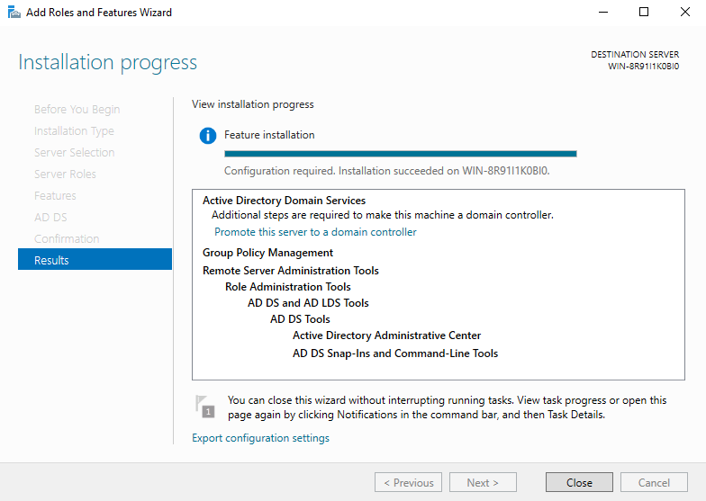

---
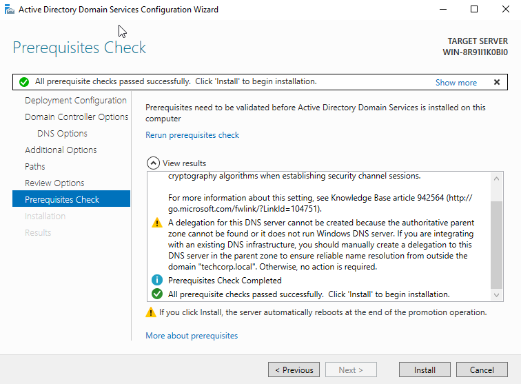

---

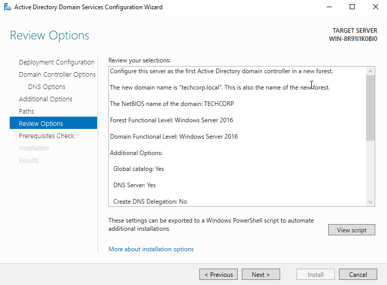

---

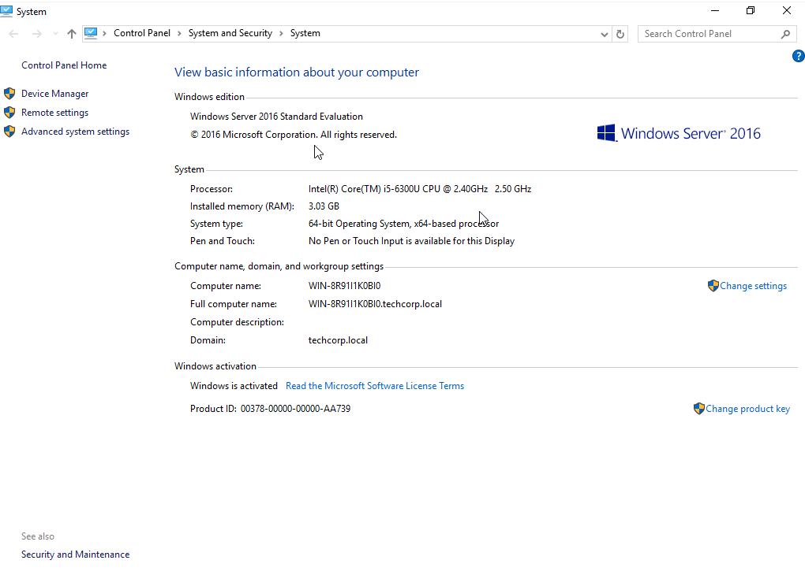

> **Why this matters:** Static IP and loopback DNS are the two most common misconfigurations that break AD promotion. Getting these right before running the wizard is a habit worth building early.

---

## Part 2 — OU Structure, Users, and Groups

### Organizational Unit Design

Three OUs were created under `techcorp.local` to reflect the company's department structure. Separating users by OU is what makes Group Policy targeting and delegation of control possible later.

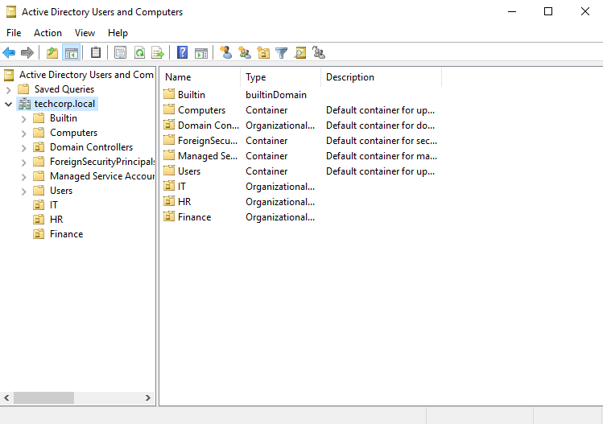

### Users and Security Groups

Users were created inside their respective OUs and added to department security groups. Groups — not individual users — are assigned to permissions and policies. This is the correct approach for any environment that will grow.

| Department | Users | Group |
|-----------|-------|-------|
| HR | John Carter, Anna Hill | HR_Group |
| IT | Mike Reed, Sara Lane | IT_Group |

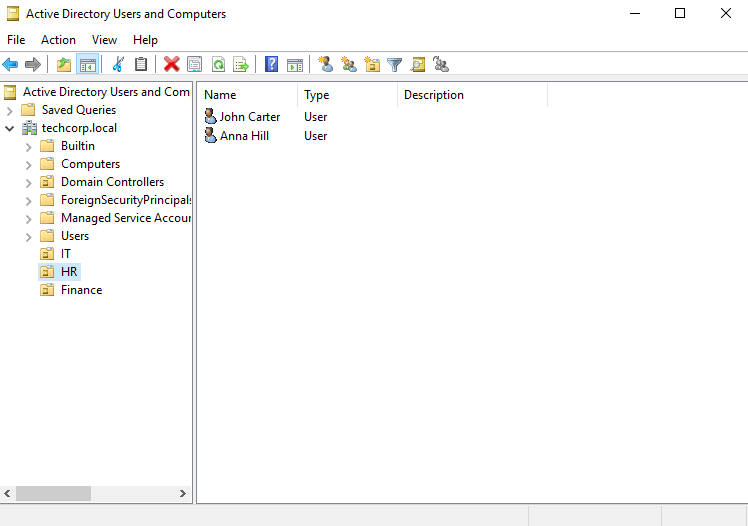

---

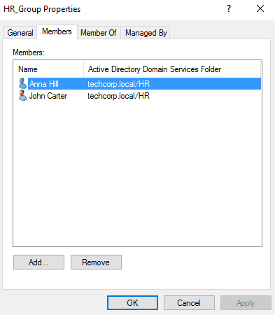

---

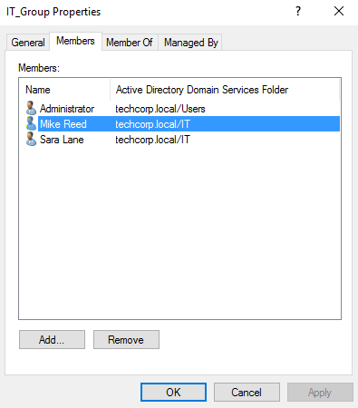

---

## Part 3 — Group Policy

### Restricting Control Panel for HR Users

A GPO named `HR-ControlPanel-Restriction` was created and linked to the HR OU. The setting **"Prohibit access to Control Panel and PC settings"** was enabled under:

`User Configuration > Administrative Templates > Control Panel`

This prevents HR users from opening Control Panel or the Windows Settings app entirely.

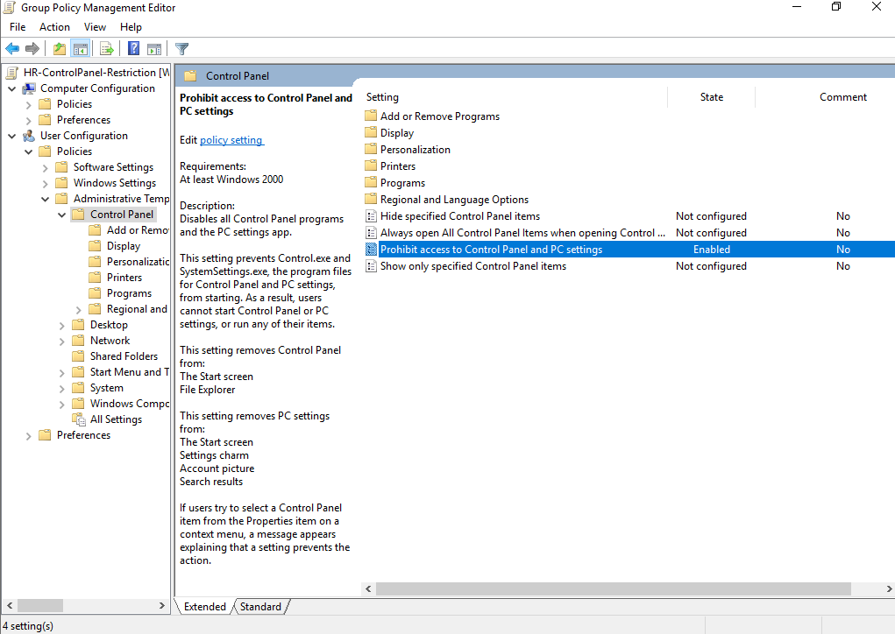

---

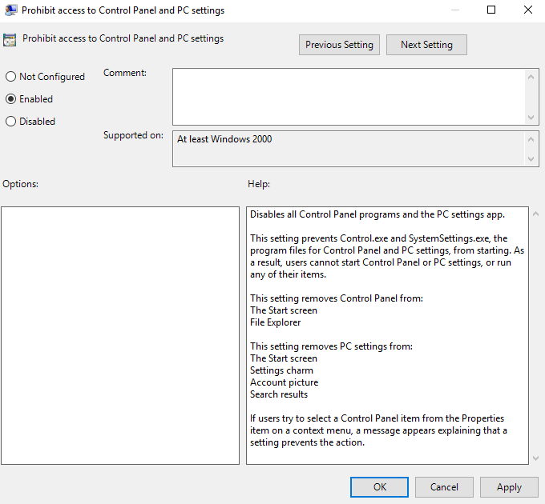

### Password Policy

A domain-wide password policy was enforced via the Default Domain Policy:

| Policy | Value |
|--------|-------|
| Enforce password history | 24 passwords |
| Maximum password age | 42 days |
| Minimum password age | 1 day |
| Minimum password length | 8 characters |
| Complexity requirements | Enabled |
| Reversible encryption | Disabled |

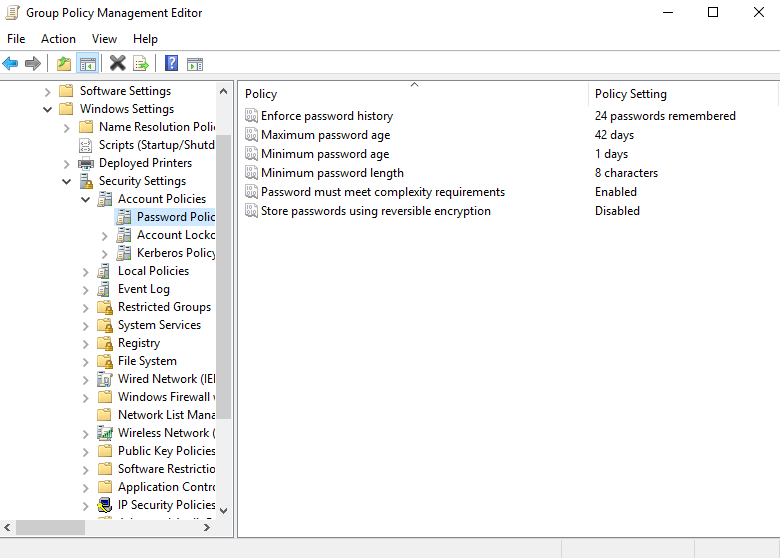

### Account Lockout Policy

To protect against brute-force attempts, an account lockout policy was configured:

| Policy | Value |
|--------|-------|
| Account lockout threshold | 3 invalid logon attempts |
| Account lockout duration | 30 minutes |
| Reset lockout counter after | 30 minutes |

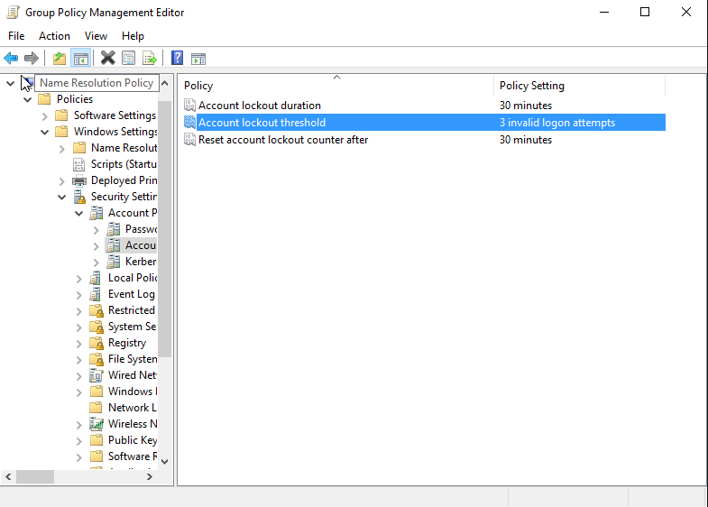

Policy changes were applied immediately using:

```cmd
gpupdate /force
```

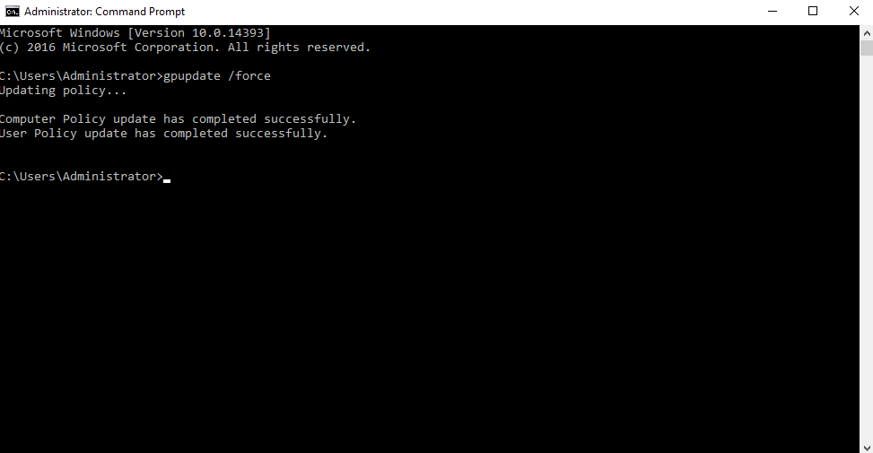

---

## Part 4 — Shared Folders and Permissions

### Folder Structure

Two department folders were created under `C:\CompanyShares` and shared over the network:

```
C:\CompanyShares\
├── HR_Files\
└── IT_Files\
```

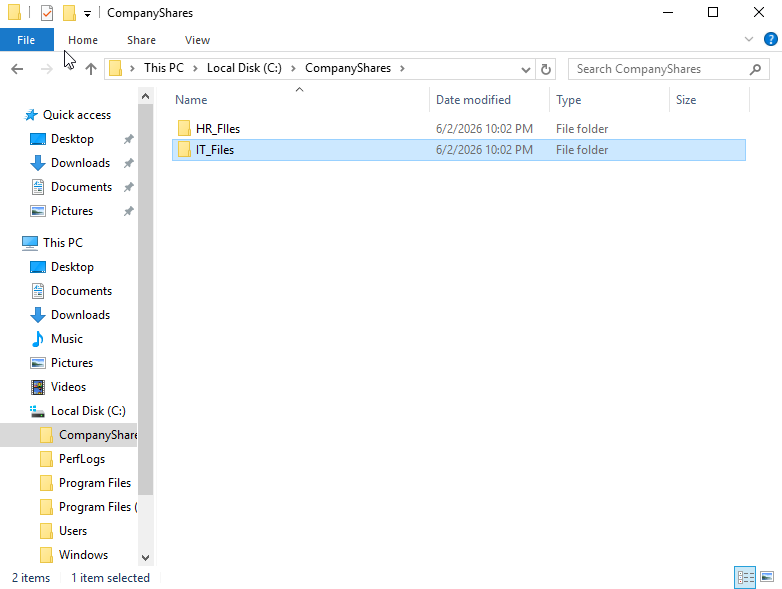

### Permission Design

Permissions were applied at two layers — Share and NTFS — following the principle of least privilege. Groups, not individual users, were assigned access.

**HR_Files — Read only (HR_Group)**

| Layer | Permission |
|-------|-----------|
| Share | Read |
| NTFS | Read, Read & Execute, List Folder Contents |

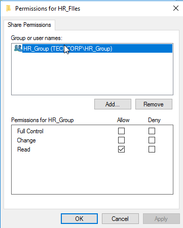

---

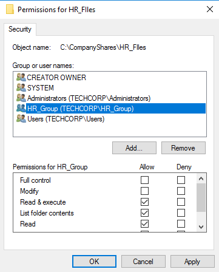

**IT_Files — Full Control (IT_Group)**

| Layer | Permission |
|-------|-----------|
| Share | Full Control, Change, Read |
| NTFS | Full Control, Modify, Read & Execute, List Folder Contents, Read |

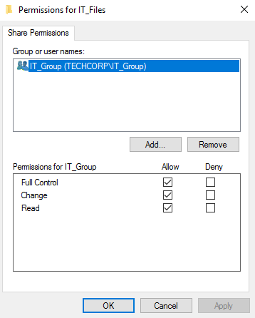

---

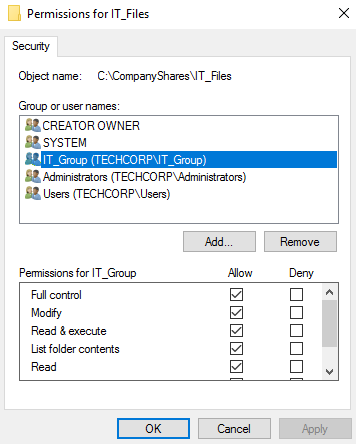

> **Why two permission layers:** Share permissions apply only over the network. NTFS permissions apply always, including local access. Best practice is to grant Full Control at the share level and control access precisely through NTFS. Here HR received Read at both layers intentionally, since they should not modify department files.

### Mapped Network Drive

The `IT_Files` share was mapped as drive `I:` on a client machine, confirming the share is accessible over the network with the correct permissions applied.

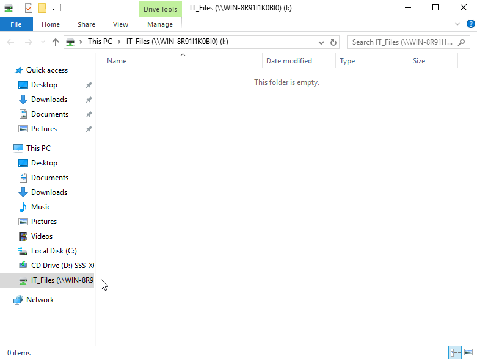

---

## Part 5 — Account Troubleshooting

### Scenario

User `john.carter` was locked out after 3 failed login attempts — exactly the lockout threshold set in policy. This was treated as a real helpdesk ticket: verify the issue first, then resolve it.

### Step 1 — Verify with PowerShell

Before touching anything in the GUI, the account status was confirmed using PowerShell:

```powershell
Get-ADUser -identity "john.carter" -Properties LockedOut, BadLogonCount `
  | Select Name, LockedOut, BadLogonCount
```

Output confirmed: `LockedOut: True`, `BadLogonCount: 3`

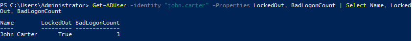

### Step 2 — Unlock via ADUC

The account was unlocked through Active Directory Users and Computers by navigating to the user's **Account** tab and checking **"Unlock account"**.

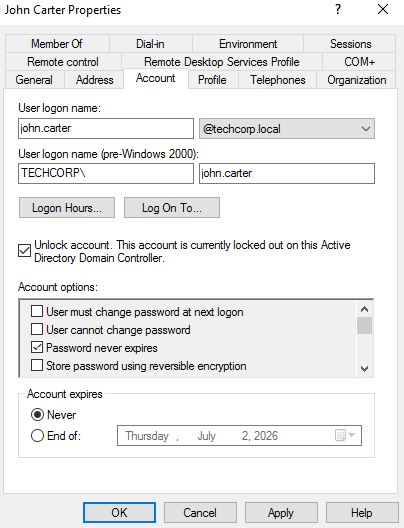

### Step 3 — Reset the Password

The password was reset via ADUC. Confirmation dialog verified the change was applied successfully.

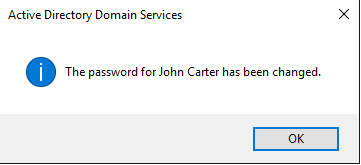

> **Why verify with PowerShell first:** In a production environment, always confirm the actual state of an account before making changes. PowerShell gives a precise, auditable view — important if the issue escalates or needs to be documented.

---

## Domain Login

Successful authentication as `TECHCORP\Administrator` confirms the domain controller is fully operational and domain logins are working as expected.

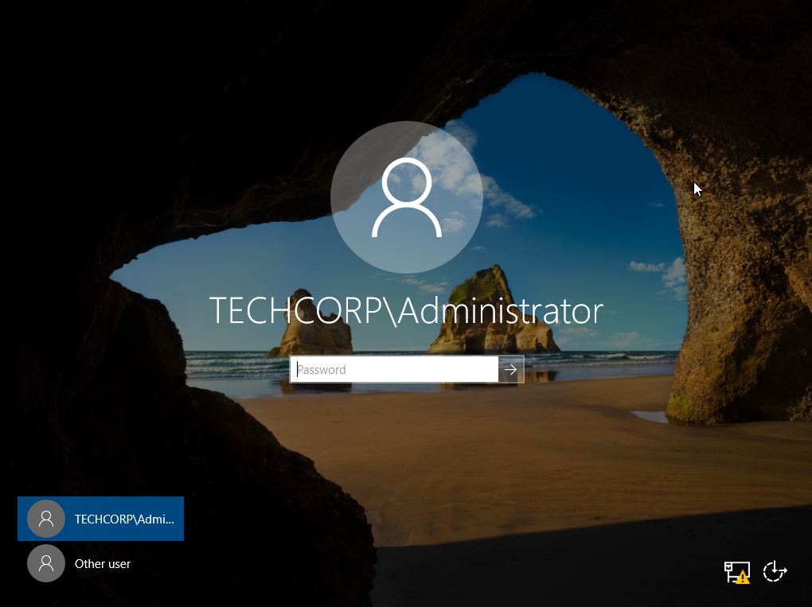

---

## What I Learned

- The order of operations matters: static IP and DNS must be correct *before* AD DS promotion, not after
- GPOs only apply correctly when linked to the right OU — testing with `gpupdate /force` and then verifying the result is essential
- NTFS and Share permissions are two separate layers; understanding how they interact is critical for file server work
- Checking account status in PowerShell before touching the GUI is the professional approach — it gives you evidence and avoids mistakes
- Assigning permissions to groups instead of individual users is not just best practice, it is the only approach that scales

## What I Would Add Next

- A second Windows 10 client VM joined to the domain to test GPOs and share access from a real user session
- Fine-Grained Password Policies (PSOs) to apply stricter rules to admin accounts
- Audit policy configuration and reviewing Security Event logs (Event ID 4740 for lockouts)
- Automating user creation with a PowerShell script instead of the GUI
